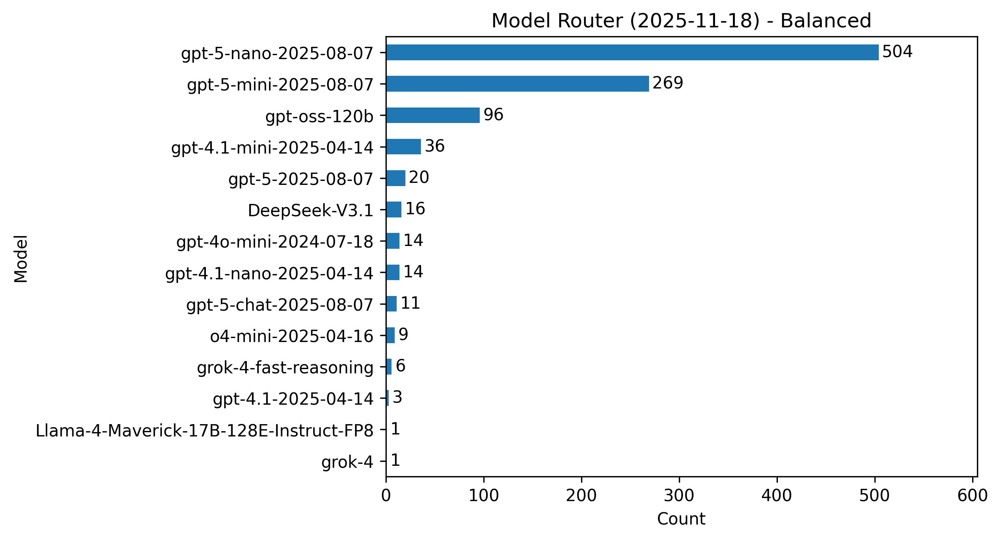
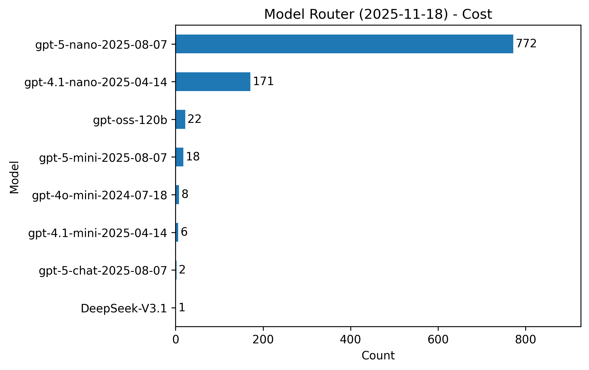
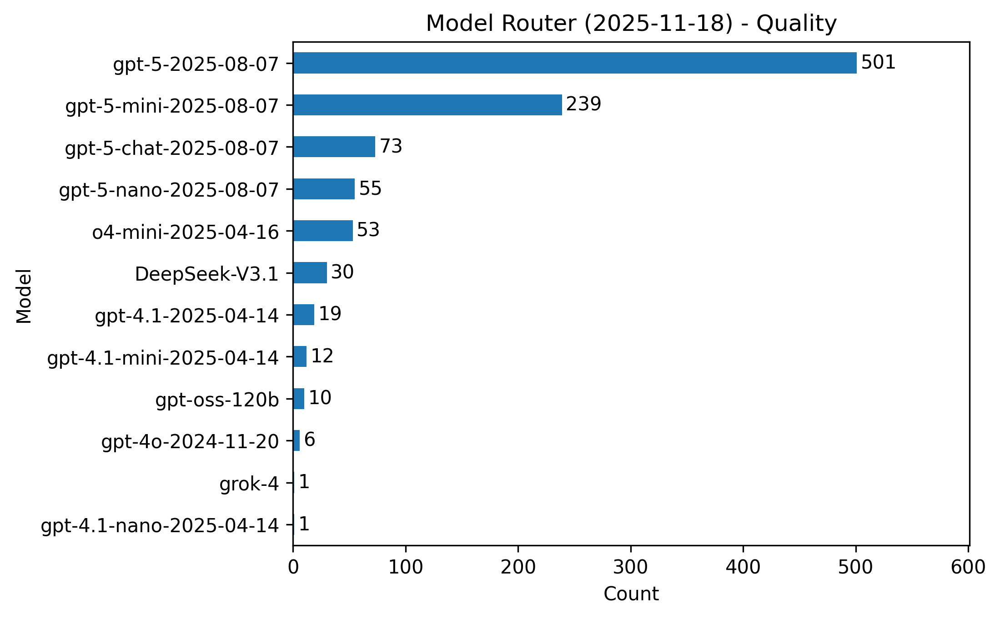

# Model Router Evaluation (Nov 2025)

Model router for Microsoft Foundry reached general availability with the 2025-11-18 release, adding routing profiles (Balanced, Cost, Quality) and support for custom model subsets so AI engineers can optimize on cost and latency without deploying every base model.


Model router supports custom subsets: you can specify which underlying models to include in routing decisions. This gives you more control over cost, compliance, and performance characteristics.


## Experiment Overview

- **Objective**: Observe how GA Model Router (version 2025-11-18) selects underlying models across the Balanced, Cost, and Quality routing profiles.
- **Date**: November 2025
- **Dataset**: First 1,000 prompts from the [data-is-better-together/10k_prompts_ranked](https://huggingface.co/datasets/data-is-better-together/10k_prompts_ranked) Hugging Face dataset.
- **Runs**: Three independent passes (one per preset profile) against the same prompt set.
- **Outputs captured**: Underlying model identifier, chosen profile, and full model response for each prompt.

## Methodology

1. **Environment preparation**
   - Load Azure credentials and deployment metadata from `.env` (`AZURE_OPENAI_API_ENDPOINT`, `AZURE_OPENAI_API_MODEL`, `AZURE_OPENAI_API_KEY`, `AZURE_OPENAI_API_VERSION`).
   - Instantiate the `AzureOpenAI` client with a 60 second HTTP timeout and zero retries to keep the pipeline deterministic.
2. **Prompt ingestion**
   - `run_batch.py` pulls prompts via the Hugging Face `datasets` SDK and persists them to `prompts_cache.jsonl` to avoid re-downloading between runs.
3. **Batch execution**
   - For each profile, configure the Model Router deployment accordingly within Foundry, then invoke the script to stream the cached prompts.
   - The script stops after 1,000 successful writes (`OUTPUT_LIMIT`) and appends each result to the profile-specific JSONL file (`results_Balanced.jsonl`, `results_Cost.jsonl`, `results_Quality.jsonl`).
   - Failures (timeouts or API errors) are logged and skipped; no retries were attempted in this test.
4. **Post-processing**
   - Responses were aggregated to count how many prompts each underlying model served per profile.
   - The counts drive both the charts and the summary tables below.

Reproduce the experiment with:

```pwsh
# Create and activate your Python environment as needed
pip install -r requirements.txt  # datasets, httpx, python-dotenv, tqdm, openai

# Populate .env with your Azure OpenAI connection details
# Then execute the batch script for each routing profile configuration
python run_batch.py
```

# Results

Each histogram shows the distribution of underlying models selected by Model Router for the 1,000 prompts per profile.
## Balanced profile


| Model | Count | Share |
| --- | --- | --- |
| gpt-5-nano-2025-08-07 | 504 | 50.4% |
| gpt-5-mini-2025-08-07 | 269 | 26.9% |
| gpt-oss-120b | 96 | 9.6% |
| gpt-4.1-mini-2025-04-14 | 36 | 3.6% |
| gpt-5-2025-08-07 | 20 | 2.0% |
| DeepSeek-V3.1 | 16 | 1.6% |
| gpt-4.1-nano-2025-04-14 | 14 | 1.4% |
| gpt-4o-mini-2024-07-18 | 14 | 1.4% |
| *Others* | 21 | 2.1% |

Balanced routing primarily relied on `gpt-5-nano` and `gpt-5-mini`, with occasional escalation to larger or specialty models for more demanding prompts.


# Cost profile (version 2025-11-18)



| Model | Count | Share |
| --- | --- | --- |
| gpt-5-nano-2025-08-07 | 772 | 77.2% |
| gpt-4.1-nano-2025-04-14 | 171 | 17.1% |
| gpt-oss-120b | 22 | 2.2% |
| gpt-5-mini-2025-08-07 | 18 | 1.8% |
| gpt-4o-mini-2024-07-18 | 8 | 0.8% |
| gpt-4.1-mini-2025-04-14 | 6 | 0.6% |
| gpt-5-chat-2025-08-07 | 2 | 0.2% |
| DeepSeek-V3.1 | 1 | 0.1% |

The cost-focused profile strongly favors the nano variants of gpt-4.1 and gpt-5, only escalating when the heuristic deems it necessary.

# Quality profile (version 2025-11-18)



| Model | Count | Share |
| --- | --- | --- |
| gpt-5-2025-08-07 | 501 | 50.1% |
| gpt-5-mini-2025-08-07 | 239 | 23.9% |
| gpt-5-chat-2025-08-07 | 73 | 7.3% |
| gpt-5-nano-2025-08-07 | 55 | 5.5% |
| o4-mini-2025-04-16 | 53 | 5.3% |
| DeepSeek-V3.1 | 30 | 3.0% |
| gpt-4.1-2025-04-14 | 19 | 1.9% |
| gpt-4.1-mini-2025-04-14 | 12 | 1.2% |
| gpt-oss-120b | 10 | 1.0% |
| gpt-4o-2024-11-20 | 6 | 0.6% |
| *Others* | 12 | 1.2% |

The quality profile allocates roughly half of the workload to full `gpt-5`, with a mix of reasoning and high-capability open models when higher fidelity is required.

## Caveats and Recommendations

- Results are **prompt dependent**: different prompt corpora can drive very different routing patterns. Run the batch with your own workloads to build a representative baseline.
- Routing decisions are **nondeterministic**. Replaying the same prompt may yield a different underlying model, especially when multiple candidates score similarly.
- Anthropic Claude models are now supported in Model Router 2025-11-18, but they appear only if you deploy them to your Foundry resource and explicitly include them in the model subset. They were not enabled for this experiment, so no Claude traffic is recorded here.
- Pricing: Model Router charges for input tokens routed through the service (currently USD $0.15 per million input tokens) **plus** the consumption of the selected underlying models. Monitor both components in Cost Analysis.

## References

- [Model router concepts](https://learn.microsoft.com/azure/ai-foundry/openai/concepts/model-router?view=foundry)
- [data-is-better-together/10k_prompts_ranked dataset](https://huggingface.co/datasets/data-is-better-together/10k_prompts_ranked)
- [Ignite 2025 session BRK195](https://ignite.microsoft.com/en-US/sessions/BRK195)
